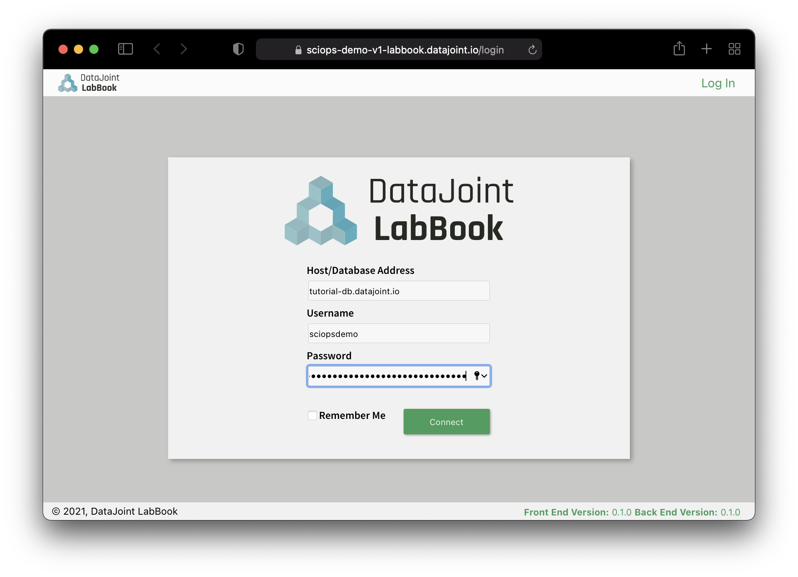
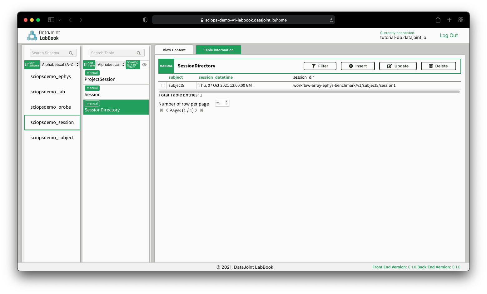

_View the latest documentation site here:_ [{{cookiecutter.docs_url}}]({{cookiecutter.docs_url}}).

<!--intro-start-->

# `{{cookiecutter.__project_name}}`

_A {{cookiecutter.workflow}} {{cookiecutter.pkg_type}} for {{cookiecutter.organization}}_

## Description

TODO: finish description.

Welcome to the {{cookiecutter.organization}} {{cookiecutter.pkg_type}} service!

This service is designed for a user to upload their raw [_modality type_] data acquired with [_description_], which will then be automatically processed with [_..._]. The service also provides online Jupyter notebooks to visualize the results.

This [workflow](https://github.com/{{cookiecutter.github_user}}/{{cookiecutter.github_repo}}) uses components from open-source packages, including the DataJoint Elements:

- element and url
- element and url

Please follow the steps listed below to begin working with the platform.

## Using the {{cookiecutter.pkg_type}} Services

### Account Setup

1. Create a free account at [accounts.datajoint.io](https://accounts.datajoint.io/signup)


2. Create a free GitHub account at [github.com](https://github.com/signup)

!!! attention
    Please email us at [support@datajoint.com](mailto:support@datajoint.com) after you create these accounts so we can ensure your service is configured properly.

### DataJoint LabBook

_Insert your experimental session metadata._

**Log in to DataJoint LabBook**

[https://labbook.datajoint.io/](https://labbook.datajoint.io/)

- Host: `tutorial-db.datajoint.io`
- Username: `<datajoint.io account username>`
- Password: `<datajoint.io account password>`



DataJoint LabBook displays data from your database.

| Left Column | Middle Column          |           Right Column |
| :---------- | :--------------------- | ---------------------: |
| Schemas     | Tables within a schema | Entries within a table |

**Enter subject information**

- In the left column, navigate to the `subject` schema
- In the middle column, navigate to the `Subject` table
- In the right column, `Insert` a new subject


**Enter session information**

- In the left column, navigate to the `session` schema
- In the middle column, navigate to the `Session` table
- In the right column, `Insert` a new experimental session for the
  subject


**Enter session directory information**

- In the left column, navigate to the `session` schema
- In the middle column, navigate to the `SessionDirectory` table
- In the right column, `Insert` a new entry to identify where the data
  is located (relative to the `inbox` directory)



### DataJoint SciViz

...

### DataJoint Axon (Data Upload)

...

### DataJoint CodeBook (JupyterHub)

...

<!--intro-end-->
<!--install-start-->

Thank you for using the {{cookiecutter.organization}} {{cookiecutter.pkg_type}} cloud-based platform.

## Installation

!!! note
    The following is intended for developers and is not required for users of the {{cookiecutter.pkg_type}} services.

### 1. Clone the repository

First, clone a local copy of the [project repository](https://github.com/{{cookiecutter.github_user}}/{{cookiecutter.github_repo}}) and change to the location of that directory:

```bash
git clone https://github.com/{{cookiecutter.github_user}}/{{cookiecutter.github_repo}}.git
cd "{{cookiecutter.__project_name}}"
```

### 2. Create a new python environment

We recommend creating an isolated [virtual environment](https://realpython.com/python-virtual-environments-a-primer/) to avoid any conflicts with your existing Python packages or interpreter. You can create a virtual environment by first installing [`conda`/`mamba`](https://github.com/conda-forge/miniforge#mambaforge):

1. Create an environment using the packages listed in `environment.yml`:

```bash
mamba env create -f environment.yml --force
```

2. Activate the new environment:

```bash
conda activate {{cookiecutter.__pkg_import_name}}
```

### 3. Install the package `{{cookiecutter.__project_name}}`

After the new virtual environment has been created and activated, install this python package using `pip>=62.0` (`pip` is already in the list of requirements from the `environment.yml` file).

To avoid installing other additional packages, use the following command (see [_contrib_](./CONTRIBUTING.md#setting-up-a-local-development-environment) for extra installing packages):

```bash
pip install .
```

If you need to uninstall the package, do so with `pip`:

```bash
pip uninstall {{cookiecutter.__project_name}}
```

#### Additional setup for local development and testing

See the [_Development setup_](./CONTRIBUTING.md#setting-up-a-local-development-environment) documentation for information on how to install additional packages and tools for local development and testing environments.

<!--install-end-->
<!--rest-of-doc-start-->

## Project Organization

```
├── .github                 <- GitHub workflows, templates, and actions.
├── configs                 <- Store project/build/analysis configuration files here.
├── data
│   ├── external            <- Data from third party sources.
│   ├── interim             <- Intermediate data that has been transformed.
│   ├── processed           <- The final, canonical data sets for modeling/plots.
│   └── raw                 <- Any original, immutable data files/dumps.
├── docker                  <- Docker image content, e.g., Dockerfile, docker-compose.yml
├── docs                    <- Directory for MkDocs documentation for gh-pages.
├── figures                 <- Generated plots and figures for sharing, reports or documentation.
├── notebooks               <- Jupyter notebooks. Naming convention is a number for
│                              ordering, the creator's initials, and a description.
|                              For example, '1.0-fw-initial-data-exploration'.
├── scripts                 <- Analysis examples or production scripts which rely on
│                              importing the actual Python package, e.g. running queries.
├── src
│   └── {{cookiecutter.__pkg_import_name}}             <- Actual Python package where the main functionality goes.
├── tests                   <- Unit and integration tests which can be run with `pytest` or `nox`.
├── .cookiecutter.json      <- Options specified during template generation.
├── .gitignore              <- Files and folders to ignore for git.
├── .pre-commit-config.yaml <- Configuration of pre-commit git hooks.
├── CHANGELOG.md            <- Changelog to keep track of new features and fixes.
├── CONTRIBUTING.md         <- Documentation on how to contribute to the project.
├── *.code-workspace        <- Visual Studio Code workspace file.
├── {{cookiecutter._djconfig}}      <- DataJoint configuration file.
├── environment.yml         <- The conda environment file for new virtual environments.
├── LICENSE                 <- Open source license.
├── mkdocs.yml              <- Configuration for building the documentation with MkDocs.
├── noxfile.py              <- `nox` automation file for continuous integration steps.
├── pyproject.toml          <- Build system configuration for the project.
└── README.md               <- The top-level "read me" for the repository.
```

<!--rest-of-doc-end-->

©️ Datajoint, {% now 'local', '%Y' %}. Licensed under the MIT license.
